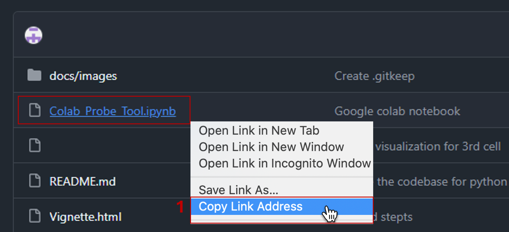
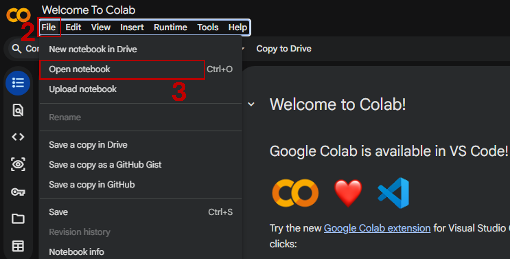
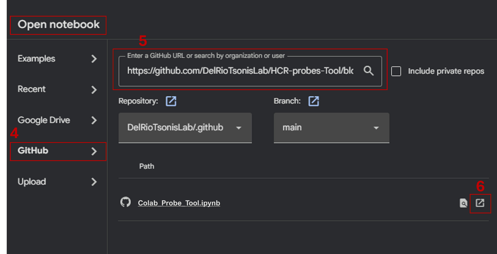
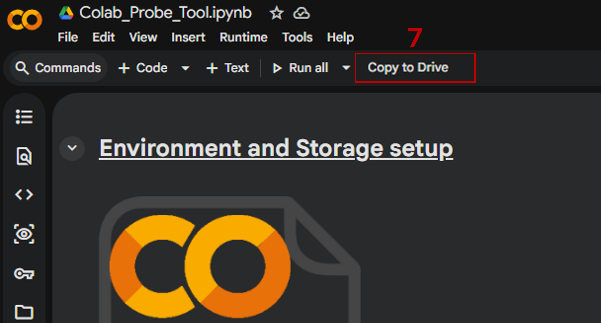

# HCR Probe design for IDT ordering

## Overview
This repository provides a guided, reproducible workflow for designing HCR-FISH probe sets, with documentation supporting both cloud-based and desktop usage.
This tool is an **adapted version of the open-source HCR3.0 Probe Maker** originally developed by [The Ozpolat Lab](https://bduyguozpolat.org/). 
The original software was released under the **GPL-3.0 license**, and this repository maintains the same license.

---

## Features

> Google Colab-hosted Jupyter Notebook workflow (no local setup required)

> Exports an order-ready `.xlsx` table for commercial synthesis (e.g. IDT)

---

## Run in Google Colab (recommended)
Open `Colab_Probe_Tool.ipynb` in Colab and follow the steps below in order (Setup in Colab + Make a copy in Drive).

Setup in Colab
|--------------------------------------------|

1. Click `Colab_Probe_Tool.ipynb` in this GitHub repository and copy its **URL**.


2. In [Google Colab](https://colab.research.google.com) choose **File** and **Open notebook**.


3. Select the **Github** tab, paste the URL in the **Search** field and click ↗️ icon to open notebook in a new tab.


Make a copy in Drive
|--------------------------------------------|
4. Once the notebook opens, click in **Copy to Drive** to run and edit your own copy.


---

## Run on your desktop (optional)
Local setup instructions are provided in Requirements and General Workflow below.

---

## Requirements

- [**Python** v3.12.11+](https://www.python.org/downloads/)
- [**Jupyter Notebook** v7.0.4](https://docs.jupyter.org/en/latest/install/notebook-classic.html)
- `blastn` from [**NCBI BLAST+ v2.17.0+**](https://ftp.ncbi.nlm.nih.gov/blast/executables/blast+/2.17.0/)
- packages.txt (complete list of Python packages)

---

## General Workflow

Run *HCR_Probe_Tool.ipynb* to design probes
|--------------------------------------------|
1. See the included `Vignette.html` for a full example of how the tool was used with Pax6 and *Pleurodeles walt* cDNA as the reference species.

To perform off-target filtering using BLAST
|--------------------------------------------|

2. Download and install `blastn`:
   * To run blastn smoothly, ***copy the bin folder*** from the BLASTn installation into the same directory as your `HCR_Probe_Tool.ipynb`, you should have like this:
      ```python
      ├───packages.txt  
      ├───bin  
               blastdbcheck.exe  
               ...  
               blastn.exe  
               blastn.exe.manifest  
               ...  
      ├───Vignette.html  
      ├───HCR_Probe_Tool.ipynb  
      ├───helper.py  
      ├───makercb.py  
      ├───cDNA-(optional)  
      ├───README.md  
      └───__pycache__
      ```
   
3. Download the cDNA reference FASTA file for your species of interest.  
   * For example, for newt (*Pleurodeles walt*): **GCF_031143425.1_aPleWal1_rna.fna** from NCBI

4. For users not familiar with Linux:
   * Use Anaconda Navigator to install `Python 3.12` and `Jupyter Notebook` in an user-friendly environment.
   * Once you open your notebook, just uncomment the thrird cell and **RUN** at once, when it finishes, comment it again to avoid troubles later.
     ```python
     %pip install -r packages.txt
     ```

   
